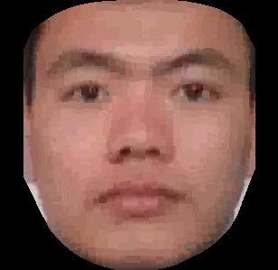
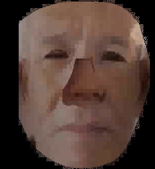
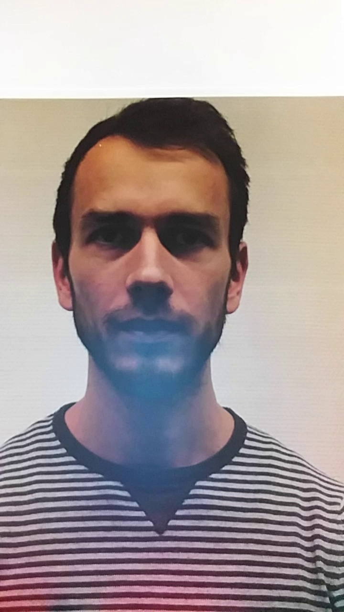
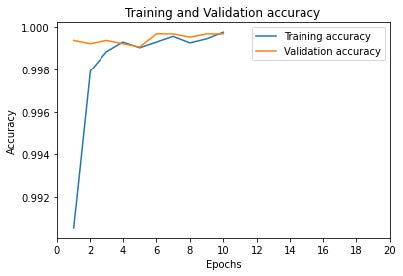
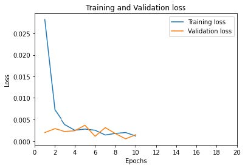

# Face-Spoofing-Detection-Using-CNN

The aim of this thesis is to implement a method for automatic detection of forged faces using facial images. The methodology employed in this thesis involves transfer learning techniques and convolutional neural networks. Specifically, our proposed architecture consists of a network with several fully connected layers, leveraging pre-trained weights as the primary foundation from VGGFace architecture.

In this research, the problem of forged faces detection is treated as a binary classification problem, where the classes are labeled as 0 and 1. Here, 1 represents a genuine face, while 0 represents a forged face. The dataset used for this study is the CASIA-SURF dataset, comprising both genuine and forged images. The collection of this dataset is particularly aimed at applications related to face forgery detection, hence it serves as a suitable resource for conducting this research.

### Features for Face Forgery Detection Project:

1. **Automatic Face Detection**: Implement algorithms to automatically detect faces within images.

2. **Feature Extraction**: Extract relevant features from facial images that can help distinguish between genuine and forged faces.

3. **Convolutional Neural Network (CNN)**: Utilize CNNs to learn discriminative features from facial images and make accurate predictions.

4. **Transfer Learning**: Leverage pre-trained models, such as VGGFace, to initialize network weights and expedite the training process.

5. **Binary Classification**: Implement a binary classification model to classify faces as genuine or forged based on learned features.

6. **Data Augmentation**: Apply techniques like rotation, scaling, and flipping to augment the dataset and improve model generalization.

7. **Evaluation Metrics**: Calculate evaluation metrics such as accuracy, precision, recall, and F1-score to assess the performance of the model.

8. **Cross-Validation**: Employ techniques like k-fold cross-validation to evaluate model performance and ensure robustness.

### Dataset
**CASIA SURF** is a dataset for face anti-spoofing in terms of both subjects and modalities. Specifically, it consists of subjects with videos and each sample has modalities (i.e., RGB, Depth and IR).

 
 

The **Replay-Mobile** Database for face spoofing consists of 1190 video clips of photo and video attack attempts to 40 clients, under different lighting conditions. These videos were recorded with current devices from the market -- an iPad Mini2 (running iOS) and a LG-G4 smartphone (running Android). 

 

### Figures
 
